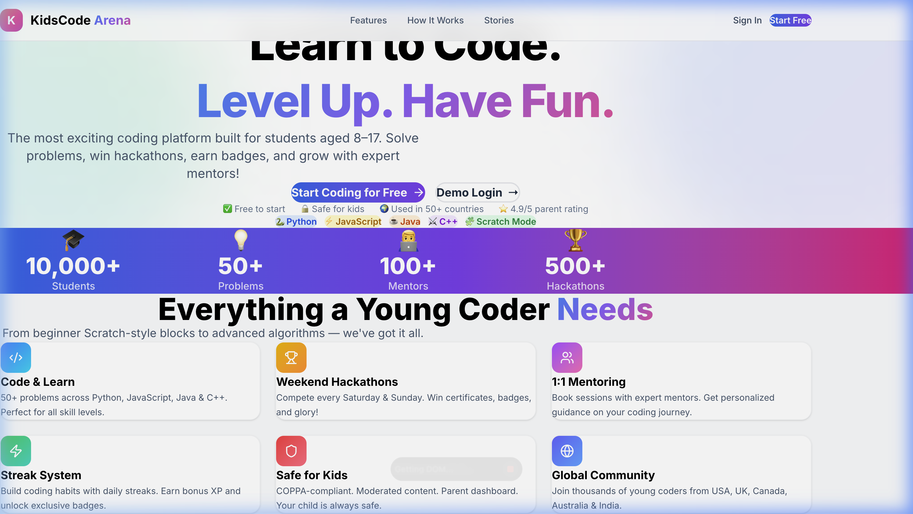
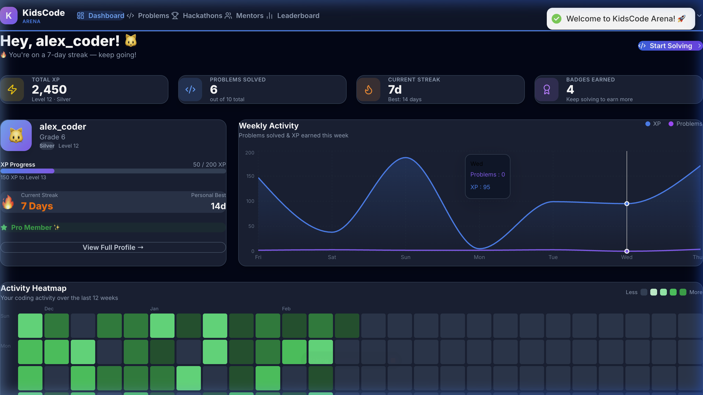
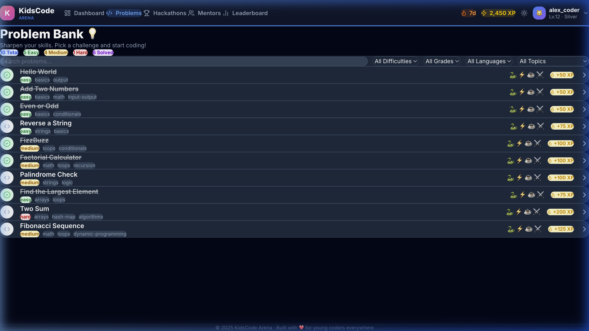
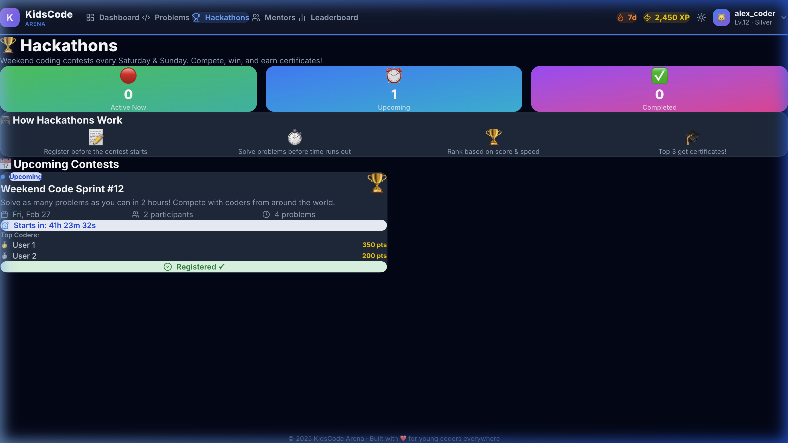
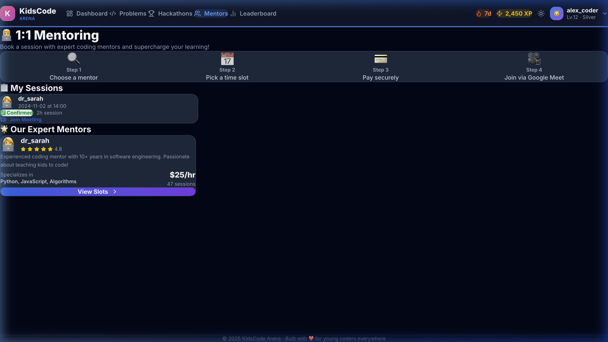
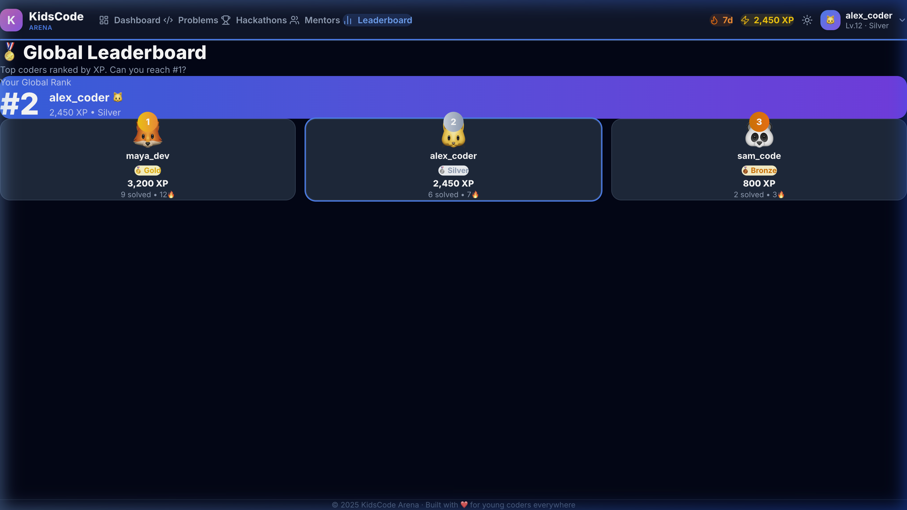
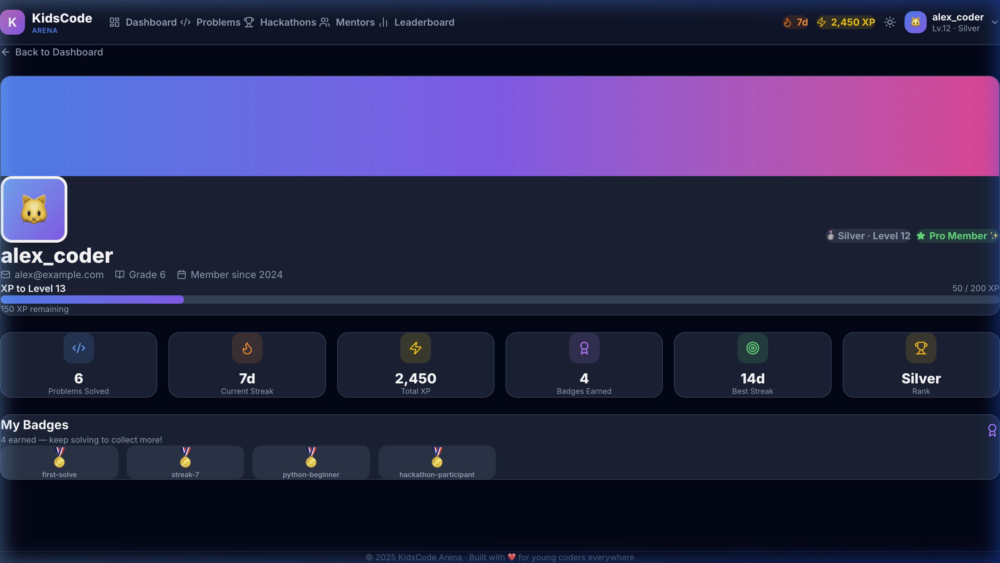
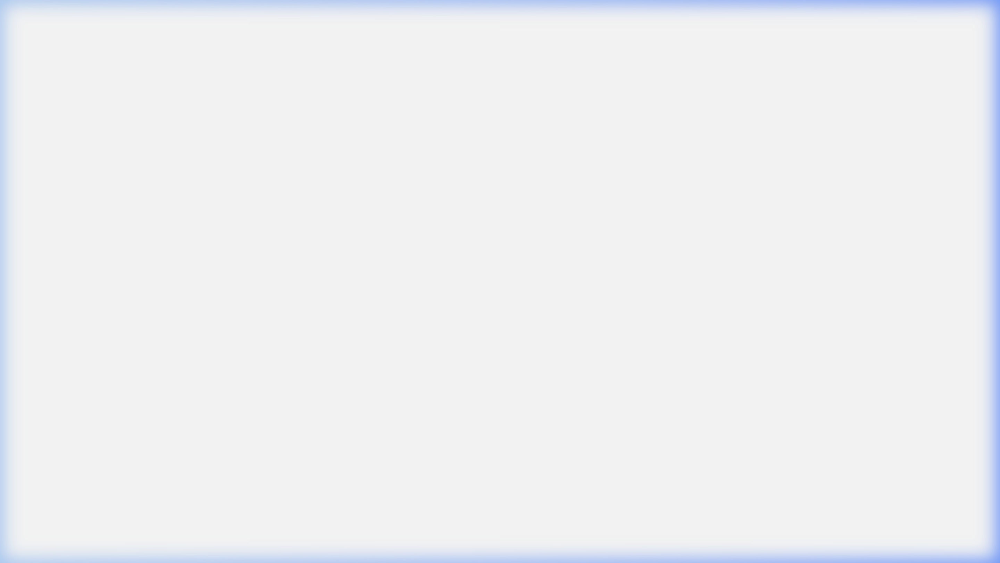
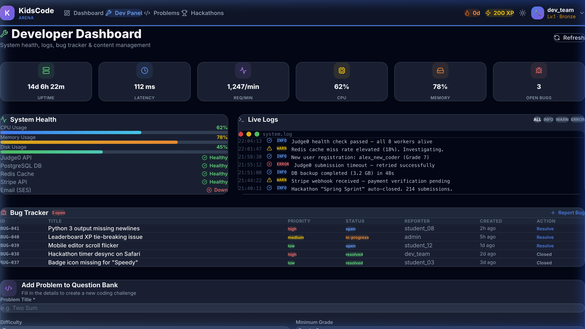
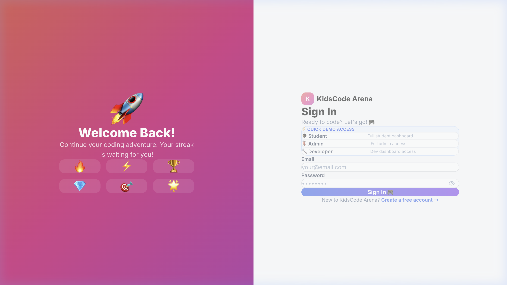

<div align="center">

# 🎮 KidsCode Arena

### A gamified coding platform for students in Grades 3–12

[](https://react.dev/)
[](https://www.typescriptlang.org/)
[](https://nodejs.org/)
[](https://vitejs.dev/)
[](https://tailwindcss.com/)

</div>

---

## 📸 Screenshots

| Landing Page | Student Dashboard |
|:---:|:---:|
|  |  |

| Problems | Hackathons |
|:---:|:---:|
|  |  |

| Mentors | Leaderboard |
|:---:|:---:|
|  |  |

| Profile | Admin Dashboard |
|:---:|:---:|
|  |  |

| Developer Dashboard | Login |
|:---:|:---:|
|  |  |

---

## 🚀 What is KidsCode Arena?

**KidsCode Arena** is a full-stack web application designed to make coding fun and engaging for young learners (Grades 3–12). It combines competitive programming, gamification, mentorship, and a learning community — all in one beautifully designed platform.

Students earn **XP**, maintain **coding streaks**, solve **daily challenges**, compete in **hackathons**, and get mentored by experienced developers. Admins manage users and send campaigns; developers monitor system health and manage the problem library.

---

## ✨ Features

### 🎓 For Students
- **Gamified Dashboard** — XP bar, level system, streak tracker, badges grid, and weekly activity chart
- **Activity Heatmap** — GitHub-style 26-week coding activity visualization with month/day labels
- **Problem Solving** — Curated problems across Easy / Medium / Hard with a built-in code editor
- **Daily Challenge** — One special problem per day with bonus XP rewards
- **Hackathons** — Browse and participate in live and upcoming coding competitions
- **Mentorship Booking** — Book 1:1 sessions with expert mentors
- **Leaderboard** — See global rankings by XP and streak
- **Profile Page** — Full stat breakdown, badge showcase, XP progress, and Pro upgrade CTA

### 🛡️ For Admins
- **User Management** — View all registered users, their roles, XP, streak, and subscription
- **Grade Analytics** — Bar chart breakdown of users by school grade
- **Email Campaigns** — Compose and send announcements directly to users
- **Platform Metrics** — Total users, active today, pro subscribers, total XP distributed

### ⚙️ For Developers
- **System Health Monitor** — Real-time CPU, Memory, and Disk usage bars
- **Service Status** — Live health checks for Judge0 API, PostgreSQL, Redis, Stripe, and Email
- **Live Log Viewer** — Terminal-style log stream with INFO / WARN / ERROR filters
- **Bug Tracker** — Table of open issues with priority and status tags
- **Problem Creator** — Form to add new coding problems with test cases and constraints

### 🌗 Global
- **Dark / Light Mode** — Full theme toggle with consistent design in both modes
- **Responsive Design** — Works on all screen sizes from mobile to desktop
- **Horizontal Navbar** — Clean top navigation with XP/streak display and profile dropdown
- **Authentication** — JWT-based login/register with role-based routing (student / admin / dev)
- **Quick Demo Access** — One-click login for Student, Admin, and Dev roles on the login page

---

## 🏗️ Tech Stack

| Layer | Technology |
|---|---|
| **Frontend Framework** | React 18 + TypeScript |
| **Build Tool** | Vite 5 |
| **Styling** | TailwindCSS 3 |
| **Animations** | Framer Motion |
| **Charts** | Recharts |
| **Icons** | Lucide React |
| **Routing** | React Router DOM v6 |
| **State Management** | Zustand (`authStore`) |
| **HTTP Client** | Axios (via `lib/api`) |
| **Notifications** | React Hot Toast |
| **Backend** | Node.js + Express + TypeScript |
| **Auth** | JWT (JSON Web Tokens) |
| **Database** | PostgreSQL (via config) |
| **Cache** | Redis |
| **Payments** | Stripe |
| **Email** | AWS SES |
| **Code Judge** | Judge0 API |

---

## 📁 Project Structure

```
kidscode-arena/
├── frontend/                  # React + Vite frontend
│   └── src/
│       ├── components/
│       │   └── Layout.tsx     # Horizontal navbar, theme toggle, footer
│       ├── pages/
│       │   ├── Landing.tsx    # Marketing landing page
│       │   ├── Login.tsx      # Auth page with quick demo access
│       │   ├── Register.tsx   # Sign up page
│       │   ├── Dashboard.tsx  # Student dashboard (XP, heatmap, charts)
│       │   ├── AdminDashboard.tsx  # Admin panel
│       │   ├── DevDashboard.tsx    # Developer panel
│       │   ├── Profile.tsx    # User profile with stats & badges
│       │   ├── Problems.tsx   # Problem list with filters
│       │   ├── ProblemSolve.tsx    # Code editor & submission
│       │   ├── Hackathons.tsx # Hackathon list & participation
│       │   ├── Mentors.tsx    # Mentor browse & booking
│       │   └── Leaderboard.tsx     # Global rankings
│       ├── store/
│       │   └── authStore.ts   # Zustand store (user, theme, auth)
│       ├── lib/
│       │   └── api.ts         # Axios instance with JWT interceptors
│       └── index.css          # Global styles, CSS variables, dark mode
│
├── backend/                   # Node.js + Express backend
│   └── src/
│       ├── index.ts           # Express app entry point
│       ├── middleware/
│       │   └── auth.ts        # JWT verification middleware
│       ├── routes/
│       │   ├── auth.ts        # /api/auth — login, register
│       │   ├── problems.ts    # /api/problems — CRUD + submissions
│       │   ├── hackathons.ts  # /api/hackathons
│       │   ├── mentors.ts     # /api/mentors + bookings
│       │   ├── badges.ts      # /api/badges
│       │   └── analytics.ts   # /api/analytics — dashboard stats
│       └── config/
│           └── database.ts    # PostgreSQL connection
│
├── docs/                      # Documentation
│   ├── screenshots/           # App screenshots (10 pages)
│   └── PLATFORM_GUIDE.md      # Detailed feature guide
│
├── .gitignore
└── README.md
```

---

## ⚡ Quick Start

### Prerequisites
- Node.js 18+
- npm or yarn
- PostgreSQL (for backend)
- Redis (for caching)

### 1. Clone the repo
```bash
git clone https://github.com/Utkarshsingh8881/kidscode-arena.git
cd kidscode-arena
```

### 2. Set up the Backend
```bash
cd backend
npm install

# Create a .env file:
cp .env.example .env
# Fill in: DATABASE_URL, JWT_SECRET, REDIS_URL, STRIPE_KEY, etc.

npm run dev
# Backend runs on http://localhost:3000
```

### 3. Set up the Frontend
```bash
cd frontend
npm install
npm run dev
# Frontend runs on http://localhost:5173
```

### 4. Quick Demo (No backend needed)
The login page has **Quick Demo Access** buttons that log you in instantly:
- **🎓 Student** — Full student experience (XP, streak, problems, hackathons)
- **🛡️ Admin** — Admin panel with user management and analytics
- **⚙️ Developer** — Dev panel with system health, logs, and bug tracker

---

## 🔐 User Roles

| Role | Access |
|---|---|
| `student` | Dashboard, Problems, Hackathons, Mentors, Leaderboard, Profile |
| `admin` | All student pages + Admin Panel (`/admin`) |
| `dev` | All student pages + Dev Panel (`/dev`) |

---

## 🌐 API Endpoints

| Method | Route | Description |
|---|---|---|
| `POST` | `/api/auth/register` | Register new user |
| `POST` | `/api/auth/login` | Login, returns JWT |
| `GET` | `/api/auth/me` | Get current user |
| `GET` | `/api/problems` | List all problems |
| `GET` | `/api/problems/:id` | Get single problem |
| `POST` | `/api/problems/:id/submit` | Submit solution |
| `GET` | `/api/analytics/dashboard` | Student dashboard stats |
| `GET` | `/api/hackathons` | List hackathons |
| `POST` | `/api/hackathons/:id/join` | Join a hackathon |
| `GET` | `/api/mentors` | List mentors |
| `POST` | `/api/mentors/:id/book` | Book a mentor session |
| `GET` | `/api/badges` | Get user badges |
| `GET` | `/api/analytics/admin` | Admin platform stats |

---

## 🎨 Design System

- **Font:** Inter (Google Fonts) — used for body; display-weight for headings
- **Colors:** Custom HSL palette via CSS variables (`--primary`, `--accent`)
- **Dark Mode:** Full coverage via `dark:` Tailwind classes + root `bg-slate-950`
- **Cards:** `bg-slate-800/80 border-slate-700 shadow-lg` (dark) / `bg-white border-gray-200 shadow-md` (light)
- **Spacing:** `flex flex-col gap-8` between sections for reliable vertical rhythm
- **Animations:** Framer Motion fade-up on every card and section

---

## 📖 Documentation

See [`docs/PLATFORM_GUIDE.md`](docs/PLATFORM_GUIDE.md) for a full feature-by-feature walkthrough with screenshots.

---

## 🤝 Contributing

1. Fork the repo
2. Create a feature branch: `git checkout -b feature/my-feature`
3. Commit your changes: `git commit -m "feat: add my feature"`
4. Push: `git push origin feature/my-feature`
5. Open a Pull Request

---

## 📄 License

MIT © 2025 Utkarsh Singh — Built with ❤️ for young coders everywhere.
